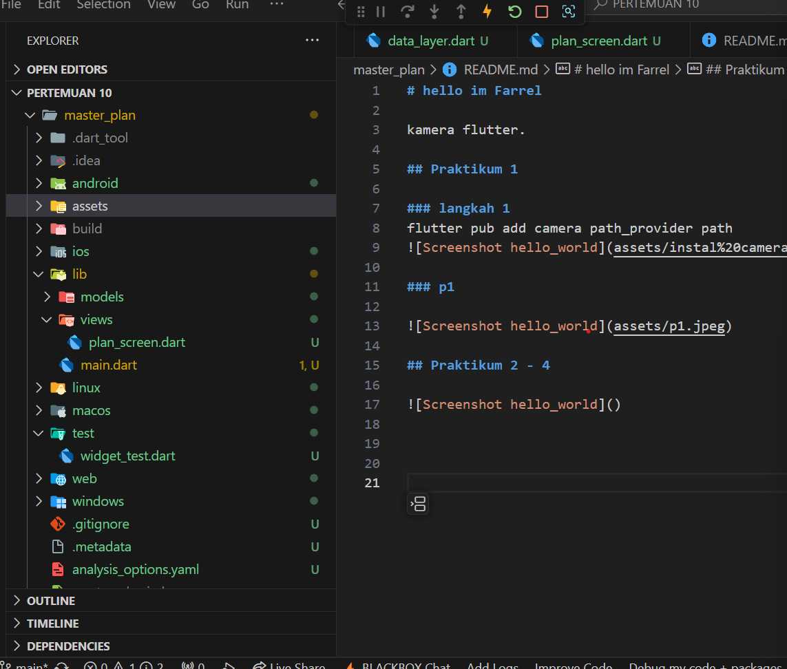

# hello im Farrel

kamera flutter.

## Praktikum 1

### Tugas 1
2.Jelaskan maksud dari langkah 4 pada praktikum tersebut! Mengapa dilakukan demikian?

- Digunakan untuk melakukan ekspor file

3.Mengapa perlu variabel plan di langkah 6 pada praktikum tersebut? Mengapa dibuat konstanta ?
-  variabel plan digunakan sebagai objek yang berfungsi untuk menyimpan dan mengelola data yang terkait dengan "plan" atau rencana yang ditampilkan pada layar aplikasi.

4.Lakukan capture hasil dari Langkah 9 berupa GIF, kemudian jelaskan apa yang telah Anda buat!

5.Apa kegunaan method pada Langkah 11 dan 13 dalam lifecyle state ?
- pada langkah 11 akan di lakukan deklarasi setelah melakukann inisisiasi
- pada langkah 13 akan di lakukan digunakan untuk membersihkan sumber daya (resources) yang tidak lagi diperlukan ketika widget dihapus dari pohon widget (widget tree)